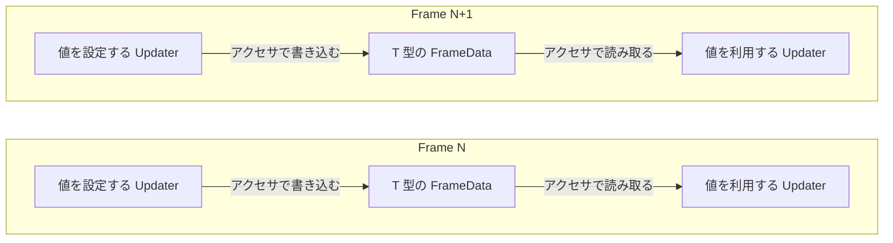

# MMViewer

Windows 11（64ビット）用のMarkdown・Mermaidビューアーです。

## 起動

`MMViewer.exe` を好きなフォルダに保存し、ダブルクリックして起動します。アプリの配布ファイルはこのexeだけです。.NETやNode.jsのインストールは不要です。

Mermaidの図を表示するには [Microsoft Edge WebView2 Runtime](https://developer.microsoft.com/microsoft-edge/webview2/) が必要です。未導入の場合は図の位置に案内を表示します。公式Mermaidエンジン・追加レイアウト・数式フォントはexeに同梱しており、図の描画にインターネット接続は使いません。

起動後に「ファイルを開く」でお手元のMarkdownファイルを、「フォルダを開く」で文書を保存しているフォルダを選びます。ファイルやフォルダをウィンドウへドラッグ＆ドロップして開くこともできます。

ファイルやフォルダのパスを起動時の引数に指定することもできます。起動中なら既存ウィンドウに追加します。

起動時に登録済みのフォルダと全タブのファイルを非同期で存在確認します。見つからない項目や確認できない項目には状態を表示し、登録は保持します。自動更新を停止したタブも存在確認は行いますが、本文は自動で読み込みません。

## フォルダ表示

- 左サイドメニューは「☰」またはCtrl+Bで開閉。境界にマウスを合わせて左右の矢印カーソルが出たら、ドラッグで幅を変更できます。変更した幅は次回起動時も保持します。
- サイドメニューと本文ビューの横・縦スクロールバーも、ライト／ダークのテーマに合わせて表示します。
- サイドメニュー上ではShift＋マウスホイールで横スクロールできます。下回転で右、上回転で左へ動きます。
- 一番上の階層にある登録フォルダは、名前またはアイコンをドラッグして並べ替えられます。移動先のフォルダ行の上半分で前、下半分で後ろへ挿入します。並び順は次回起動時も保持します。Escで中止できます。
- 「フォルダを開く」で読み込み元を追加します。既に登録したフォルダの一覧・開閉状態・開いている本文を保持し、追加したフォルダ以下を非同期で走査します。同じパスは二重登録しません。
- `.md` があるフォルダと、その上の階層のフォルダだけを表示します。`.MD` も対象です。
- 下位フォルダも含めてMarkdownファイルのないフォルダは表示しません。元の階層を保ち、登録したフォルダの直下にある `.md` も表示します。
- フォルダは開閉状態に応じたフォルダアイコン、ファイルは名前だけで表示します。＋／−や階層をつなぐ線は表示しません。
- ファイルは、名前の文字上だけでなく、同じ行の右側の余白をクリックしても開けます。
- フォルダ名・アイコンのクリックで個別に開閉できます。矢印キーや、右クリックでの一括展開・折りたたみも利用できます。
- フォルダを右クリックして「リストから削除」を選ぶと、そのフォルダと配下を一覧から外します。実際のフォルダ・ファイルと開いているタブは残ります。
- 登録したフォルダはそれぞれ一覧の最上位に1件ずつ、保存した並び順で表示します。新しく追加したフォルダは末尾へ入ります。起動直後や探索中、フォルダが見つからない場合も表示し、右クリックで探索完了を待たずにリストから外せます。
- 外した時点で進行中・待機中の探索と、その配下の読み込みをキャンセルします。更新監視も解除し、以後の探索ではそのフォルダにアクセスする前にスキップします。開いている本文は保持し、自動再読み込みを停止します。
- 一覧から外した状態とタブの自動更新停止は再起動後も保持します。「フォルダを開く」で読み込み元を開き直すと、その配下で外したフォルダも再表示して自動更新を再開します。他の読み込み元は保持します。フォルダを外すと、そのフォルダ配下の登録も解除します。
- 外した配下の文書も、タブの選択やF5で明示的に読み直せます。その操作だけではフォルダの探索・更新監視は再開しません。
- 更新監視の組み直しはバックグラウンドで行います。監視は最大64件に抑え、上限超過などで監視しきれない場合は、残したフォルダを30秒間隔で再確認します。この場合は画面下部に表示します。
- 再走査の結果は変わった項目だけを一覧に反映します。初回の読み込みや大量の変更は短い単位に分けて順次反映するため、その間も画面の操作は止まりません。
- 「更新」またはF5で登録した全フォルダを非同期で再確認します。存在しなくなった `.md` は一覧から外し、配下に `.md` がなくなった下位フォルダも外します。最上位の登録フォルダは空でも残します。監視設定の完了を待たずに確認を始め、実際のファイル・フォルダや開いているタブは削除しません。
- 循環するジャンクションやシンボリックリンクは走査しません。アクセス不可の配下はスキップします。
- フォルダ一覧に表示する文書は `.md` です。`.markdown` は「ファイルを開く」などで直接開けます。

## 操作

画面上部にメニュー、その下にタブを配置しています。

表示中のタブだけを、青い文字と上辺のラインで強調します。

タブが画面幅に収まらない場合は、右端の左右矢印でタブの並びを横スクロールできます。タブエリア上にカーソルを置くと、Shiftを押さずにマウスホイールで操作でき、下回転で右、上回転で左へ動きます。Shift＋ホイールも使用できます。表示中のタブと本文は切り替わりません。

| 操作 | キー |
| --- | --- |
| フォルダを開く | Ctrl+Shift+O |
| ファイルを開く（複数可） | Ctrl+O |
| 空タブを追加 | Ctrl+T |
| タブを閉じる | Ctrl+W / 中クリック |
| 最後に閉じたタブを復元 | Ctrl+Shift+T |
| 前後のタブへ移動 | Ctrl+Tab / Ctrl+Shift+Tab |
| サイドメニューを開閉 | Ctrl+B |
| 本文を検索 | Ctrl+F |
| 検索の次・前へ | Enter / Shift+Enter（検索欄）・F3 / Shift+F3 |
| 検索を閉じる | Esc |
| 文字と図を拡大・縮小 | Ctrl+ホイール / Ctrl+＋ / Ctrl+－ |
| 拡大率を100%に戻す | Ctrl+0 |
| ソース表示 | Ctrl+U |
| 再読込 | F5 |
| アプリ情報 | F1 |

タブはドラッグで並べ替えられます。本文は閲覧専用です。ファイル・フォルダのドラッグ＆ドロップ、本文選択・コピー、ライト／ダーク、全幅表示にも対応します。

現在の拡大率を右下に常時表示します。Ctrl＋マウスホイールやタブ切り替えに連動し、Ctrl＋0で100%に戻ります。倍率表示は整数%に丸めます。

テーマ、タブ順、選択タブ、タブごとの文字サイズ・ソース表示・読書位置・自動更新の有効状態、登録したフォルダと登録順・開閉状態・一覧から外したフォルダを `%LOCALAPPDATA%\MMViewer\session.ini` に保存します。この設定ファイルは自動で作成されます。文書本文は設定へ保存しません。開いているファイルの変更は自動で反映し、選択中の文書が削除されたときは表示を維持します。

UTF-8、BOM付きUTF-8／UTF-16を判定します。不正なUTF-8はCP932で開くかを確認します。文書の上限は10 MiBです。

## 複数タブの応答性とメモリ

最近開いた本文を最大8件・32 MiB、解析結果・レイアウト・表示画像を最大8件・64 MiBのRAMキャッシュで再利用します。初めに全量を確保せず、必要になった分だけ保持し、上限を超えた分は古いものから解放します。この上限はキャッシュ用の保持量で、表示中の文書や画面バッファなどを含むプロセス全体の上限ではありません。

キャッシュ済みのタブは本文をすぐ表示し、ファイルの更新確認はバックグラウンドで行います。変更がなければ本文の読込・解析・レイアウトを省略し、確認中のスクロール位置も保持します。F5はキャッシュを無効にして読み直します。画面バッファもサイズが同じ間は再利用します。

## Mermaidの対応範囲

**公式Mermaid 11.17.2の完全版を使用します。** 独自パーサーによる構文制限をなくし、公式エンジンが受け付ける図をWebView2で描画して本文に表示します。`subgraph` 内の `direction`、スタイル、frontmatter／initによる設定も公式エンジンの仕様に従います。

| 図 | 対応 |
| --- | --- |
| 構造・動作 | flowchart / graph、swimlane、sequence、class、state、ER、requirement、C4、architecture、eventmodeling |
| 計画・整理 | gantt、journey、mindmap、timeline、gitGraph、kanban、treeView、ishikawa、wardley、cynefin |
| チャート等 | pie、quadrant、sankey、xychart、block、packet、radar、treemap、venn、railroad（IR / EBNF / ABNF / PEG） |
| 追加機能 | ELKレイアウト、ZenUML、KaTeXによる数式表示 |

図の読み込み中も本文を操作できます。不正な構文は公式エンジンのエラーとソースを表示し、他の本文・図は表示を続けます。例えば先頭のキーワードは `flowchart` です。`lowchart` は構文エラーになります。

図は文字サイズに連動して拡大します。大きな図・表・コードは横スクロールで読めます。テーマ変更では図も再描画します。ソース表示では元のMermaidを検索・コピーできます。

表示は静止画像です。図中のリンク・JavaScriptコールバック・アニメーション操作には対応しません。公式の `securityLevel: strict` を使用し、外部画像・外部アイコンパック・外部スクリプトは取得しません。図種ごとの制限やベータ構文は同梱版の公式仕様に従います。

1図のソースは最大1 MB・辺は最大5,000本です。画像は最大1,600万画素・各辺8,192pxに収め、大きい図は画像解像度を下げます。描画時間の上限は30秒です。描画用WebView2プロセスのメモリは、前述の文書キャッシュ上限とは別に使用します。

### subgraph内の方向指定の例

## 表示上の制限

- ローカル画像はPNG / JPEG / GIF / BMP。GIFは静止表示です。WebP / SVGは代替テキストになります。
- リモート画像は自動取得しません。HTTP(S)リンクをクリックしたときだけ既定ブラウザーで開きます。
- コードの色分けは軽量な字句判定です。言語サーバー等の完全な解析ではありません。
- 本文検索から描画済みの図ラベルは除外します。ソース表示なら検索できます。
- 読書位置はスクロール比率で復元します。文書の大幅変更後に同じ段落へ戻ることまでは保証しません。

## ライセンス

Markdown解析に [md4c 0.5.2](https://github.com/mity/md4c/tree/release-0.5.2)（MIT、Martin Mitáš）を使用しています。ライセンス本文はexeに含まれています。アプリと使用ライブラリの情報はF1で確認できます。

図の表示に [Mermaid](https://mermaid.js.org/)（MIT）、ELK、ZenUML、KaTeX、Microsoft WebView2 SDKを使用しています。依存ライブラリのライセンス・通知はexeと `vendor/mermaid/THIRD_PARTY_NOTICES.txt`、`vendor/webview2/` に同梱しています。

## ビルド

Visual StudioのC++ビルドツールとCMakeを使用し、`powershell -File scripts/build.ps1 -Test` でReleaseビルド・テスト・`dist/MMViewer.exe` への配置を行います。配置前に起動中のMMViewerを閉じてください。Mermaidの実描画テストにもWebView2 Runtimeが必要です。

同梱済みの描画資産は通常のC++ビルドでそのまま使用します。資産を再生成する場合だけ、Node.jsを用意して `scripts/mermaid` で `npm ci --ignore-scripts`、`npm run build` を実行してください。バージョンは `package-lock.json` に固定しています。
