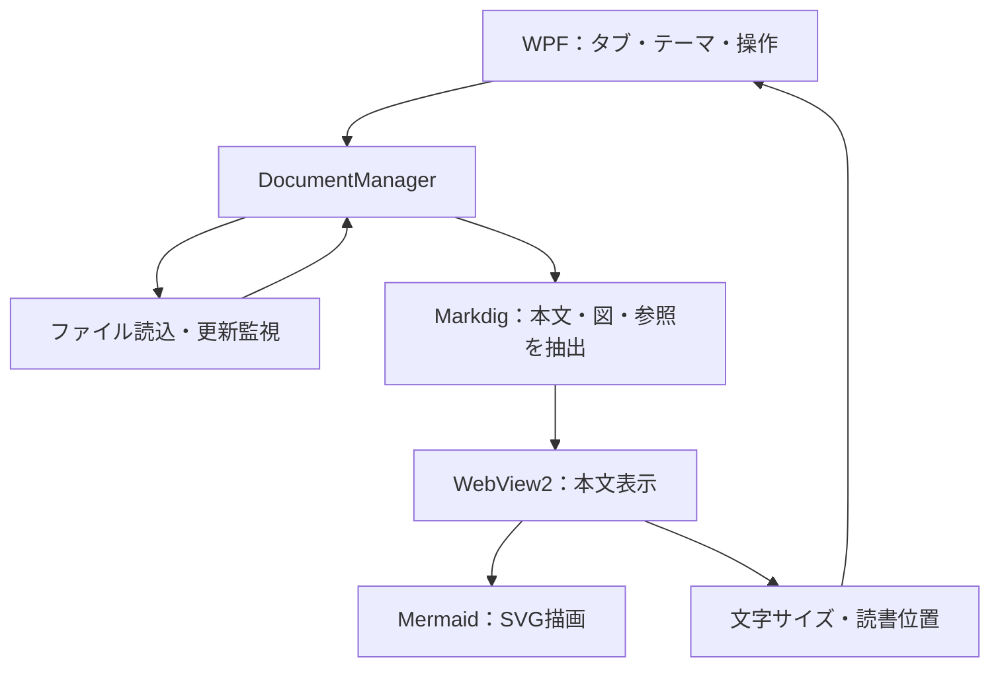

# Windows 11向け Markdown＋Mermaidビュアー 設計書

作成日：2026-09-04　／　版：0.1　／　仮称：MdViewer

このファイルはPCで実装を開始するための設計・引き継ぎ資料。アプリ本体の実装・ビルド・実機検証はまだ行っていない。ユーザーの指定と、それを具体化するための設計案を以下に記載する。

## 1. 要件と基本方針

| 区分 | 内容 |
| --- | --- |
| ユーザー指定 | Windows 11で動くMarkdown＋Mermaidビュアー |
| ユーザー指定 | Windowsのメモ帳のようなタブ形式 |
| ユーザー指定 | Ctrl＋マウスホイールでフォントサイズを変更 |
| ユーザー指定 | ライト／ダークの2テーマ |
| ユーザー指定 | 今回は設計のみ。あとでPCに引き継いで実装 |
| 設計案 | 閲覧専用のデスクトップアプリ。本文の編集・保存機能は初版の範囲外 |
| 設計案 | ローカルファイルを中心に、通信なしでMarkdownとMermaidを表示 |
| 設計案 | 1ウィンドウ内に複数タブ。再起動時にタブと読書状態を復元 |

細部は以下の初期値で実装を始められる状態とする。未計測の性能値や、実装済みと誤解される保証は置かない。

## 2. 画面と操作

| 位置 | 表示・役割 |
| --- | --- |
| 最上部 | Windows標準のタイトルバー、最小化・最大化・閉じる。Snap操作に対応 |
| 上部 | 横並びのタブ。ファイル名、閉じるボタン、末尾に「＋」。ドラッグで並べ替え |
| タブの下 | 「ファイル」「表示」と、ライト／ダーク切り替え |
| 中央 | 選択したファイルのプレビュー。本文を広く使う |
| 検索時 | 本文上部に検索欄・前／次・件数・閉じる |
| 最下部 | ファイルパス、文字コード、文字サイズ、更新状態 |

初期ウィンドウサイズは1,100×800 DIP、最小640×480 DIPを目安にする。Windowsの表示倍率に追従する。本文の左右余白は24 CSS px、通常は最大幅1,000 CSS pxで中央配置し、「幅いっぱい」へ切り替え可能。横長の表・コード・図は各ブロック内で横スクロールする。

タブがないときは「ファイルを開く」「ここにファイルをドロップ」を表示。「＋」とCtrl＋Tはこの空タブを作り、その空タブから開いたファイルは同じタブに収める。

### 2.1 タブとファイル

| 操作・状態 | 挙動 |
| --- | --- |
| Ctrl＋O／ファイルを開く | 複数の `.md` / `.markdown` ファイルを選択可能 |
| ファイルのドロップ | 複数ファイルを順番に開く。エクスプローラーから本文へのドロップにも対応 |
| 起動引数 | ファイルパスを受け付ける。起動済みなら既存ウィンドウにタブを追加 |
| 同じファイルを再び開く | 既存タブを選択。別フォルダの同名ファイルは別タブ |
| タブ名が重複 | 親フォルダを補記。ツールチップにはフルパス |
| Ctrl＋Tab／Ctrl＋Shift＋Tab | 右／左のタブへ移動。左右端で循環 |
| Ctrl＋W／タブの×／中クリック | タブを閉じる。最後のタブを閉じたら開始画面 |
| Ctrl＋Shift＋T | 最後に閉じたタブを復元。履歴は最大10件 |
| タブの並べ替え | 同じウィンドウ内でドラッグ。別ウィンドウへの切り離しは将来対応 |
| 再起動 | タブ順・選択タブ・各タブの文字サイズ・読書位置を復元 |
| 外部で保存 | 自動で再読込し、読んでいた位置をできるだけ維持。F5でも再読込 |
| ファイルの削除・移動 | タブを維持して状態を表示。開いていた内容があれば残す |

ファイルの重複判定には正規化済み絶対パスを使い、利用可能ならWindowsのファイルIDも照合する。ファイルシステムの大小文字区別を考慮し、単純な小文字化だけに依存しない。セッション復元時は起動引数のファイルを優先して選択する。

### 2.2 文字サイズ：Ctrl＋ホイール

| 項目 | 仕様 |
| --- | --- |
| 初期サイズ | 本文16 CSS px |
| 変更範囲 | 10～40 CSS px、通常のホイール1ノッチで1 px |
| 拡大・縮小 | Ctrl＋上回転で拡大、Ctrl＋下回転で縮小 |
| キーボード | Ctrl＋＋／Ctrl＋－でも変更。Ctrl＋0で16 pxに戻す |
| 適用先 | 選択中のタブの本文・見出し・表・コード。タブやメニューのサイズは維持 |
| 図 | MermaidのSVG全体を本文のサイズ比率に合わせて拡大縮小 |
| 画像 | 通常画像のサイズは文字サイズに連動させず、表示幅に合わせる |
| 記憶 | タブごとに保持して再起動時も復元。新しいタブは最後に選んだサイズを初期値にする |
| 状態表示 | ステータスバーに「文字：18 px」のように表示 |

単なるブラウザー全体のズームにせず、文書用CSS変数を更新する。見出し・コードなどはそのサイズを基準にする。Mermaidは16 px基準で一度レイアウトし、SVGの表示幅・高さを `fontSize / 16` 倍にする。ホイール操作のたびに図を解析し直さない。図の横幅に `max-width: 100%` をかけて拡大を打ち消す実装は避け、親領域でスクロールする。

WebView2標準のユーザーズームを無効にし、本文内のDOM側で `wheel` を `{ passive: false }` で受ける。Ctrlがある場合だけ既定動作を止め、アプリの文字サイズ変更へ渡す。通常ホイールは通常スクロール。WebView2内部の入力はWPFへのイベント伝播を前提にしない。タブ／メニュー上の入力はWPF側で同じコマンドに接続し、1操作を二重処理しない。[WebView2のズーム制御](https://learn.microsoft.com/en-us/dotnet/api/microsoft.web.webview2.core.corewebview2settings.iszoomcontrolenabled)

高精細ホイール・タッチパッドは `deltaMode` を考慮して差分を累積し、フレーム単位で反映する。ノッチ量は実機で調整する。サイズ変更前に画面上端のブロックとブロック内の相対位置を記録し、レイアウト変更後に復元する。OSの表示倍率と本文の文字サイズは独立して扱う。

### 2.3 ライト／ダーク

テーマはアプリ全体で共通とし、ライトとダークを手動切り替えできる。初回だけWindowsの設定を参考に初期テーマを選び、以後はユーザーが選んだテーマを保存する。

| 対象 | テーマ切り替え時の処理 |
| --- | --- |
| タイトルバー・タブ・メニュー・検索欄・ステータス | WPFのテーマリソースとタイトルバー配色を変更 |
| 本文・表・リンク・引用 | 文書側のCSS変数を変更 |
| コード | 背景・構文色・選択色を切り替え |
| Mermaid | テーマごとの設定で再描画。文字サイズは維持 |
| 通常の画像 | 元画像の色を維持 |

ライトは白系背景・濃い文字、ダークは濃いグレー背景・明るい文字を基本とする。キーボードフォーカスと選択中のタブを色以外でも判別可能にする。読み込み途中も選択テーマの背景を適用し、ダーク時の白い点滅を避ける。

テーマ変更では読書位置を記録し、本文と図の更新後に復元する。Mermaidを含めてキャッシュをテーマ別に管理し、旧テーマの非同期描画結果が新テーマを上書きしないようにする。図の明示色指定は互換性のため維持するため、文書側が固定した配色のコントラストまでは自動補正しない。

## 3. 表示する内容

### Markdown

CommonMarkを基本に、見出し、段落、強調、リンク、引用、箇条書き、画像、コードブロックと、よく使う拡張である表・取り消し線・タスクリスト・URL自動リンクを対象にする。タスクリストのチェックは閲覧表示のみ。GitHubの全表示機能との完全互換は初版の要件にしない。

コードは主要言語のハイライトに対応し、未知の言語でもプレーンテキストとして読める。本文フォントは `Yu Gothic UI` / `Meiryo` / `sans-serif`、コードは `Cascadia Mono` / `Consolas` / `monospace` を基本とする。

日本語を含むUTF-8を標準にし、BOM付きUTF-8とUTF-16を判定する。UTF-8として不正な場合は文字コード選択を表示し、CP932でも読み直せるようにする。日本語ファイル名・空白・括弧・`#` を含むパスを扱う。生HTMLは実行せず文字として表示する。

Ctrl＋Fは表示中の本文・見出し・コードを検索。Enter／Shift＋Enterで次／前、Escで閉じる。Mermaidの図内ラベル検索は初版の対象外とし、「ソース表示」に切り替えると元のMarkdown全体を検索できる。ソース表示は読み取り専用。

### Mermaid

言語指定が `mermaid` のフェンス付きコードブロックを図として描画する。初版ではflowchart、sequence、class、state、ER、gantt、pie、mindmapを確認対象にし、同梱ライブラリが標準で扱える他の構文も同じ経路で処理する。実験的構文・追加プラグインや外部アイコンを必要とする構文は個別確認とする。

図はSVGとして表示。失敗したブロックには「図を表示できません」と原因・元コードを表示し、他の図と本文の表示を継続する。図の外側には「コードを表示／コピー」を用意する。通常時は図の幅を保ち、横長の図は横スクロールで読む。

### リンクと画像

| 内容 | 初版の扱い |
| --- | --- |
| `#見出し` | 文書内へ移動。重複見出しのIDを安定して生成 |
| 別の相対 `.md` リンク | クリックで別タブに開き、指定があれば見出しへ移動 |
| `https://` / `http://` リンク | クリックしたとき既定のブラウザーで開く |
| 相対画像 | 開いたファイルの場所を基準に解決。`../` も正規化して扱う |
| PNG・JPEG・GIF・WebP | ローカル参照に対応。未読込や破損は代替表示 |
| ローカルSVG画像 | 外部参照・スクリプト等を除去した内容だけを画像として表示 |
| リモート画像 | 初版は代替テキストとURLを表示。URLは手動でブラウザーで開ける |
| その他のローカルファイル・URIスキーム | 自動実行せず対象外と表示 |

## 4. 採用構成

Windows専用という要件に合わせ、**C#／.NET 10 LTS／WPF＋WebView2**を採用案とする。タブ・ファイル操作・設定はC#側で管理し、本文と図の描画はWebView2に任せる。WPFはWindows向けUI基盤で、WebView2はネイティブアプリにHTML・CSS・JavaScriptを組み込むためのコントロール。[WPF概要](https://learn.microsoft.com/en-us/dotnet/desktop/wpf/overview/)、[WebView2概要](https://learn.microsoft.com/en-us/microsoft-edge/webview2/)、[.NETサポート方針](https://dotnet.microsoft.com/en-us/platform/support/policy)

| 層 | 技術・責務 |
| --- | --- |
| デスクトップUI | WPF。タブ、メニュー、検索、テーマ、ショートカット |
| 文書処理 | Markdig。Markdown解析、HTML生成、図ブロック・リンク・画像参照の抽出 |
| 表示エンジン | WebView2。アプリ同梱のHTML／CSS／TypeScriptを実行 |
| 図 | Mermaid.jsの安定版。同梱してオフライン描画 |
| コード | highlight.js。使用する主要言語を選んで同梱 |
| HTML／SVG処理 | DOMPurify＋用途別の許可設定 |
| ファイル・設定 | .NETの非同期I/O、FileSystemWatcher、JSON |
| Webアセットのビルド | Node.js LTS＋TypeScript＋esbuild。利用者のPCにはNode.js不要 |

Markdigは.NET用のMarkdown処理系で、構文拡張とHTML出力の制御を提供する。拡張を個別に選択し、読み取り専用の本アプリに必要な構文だけを有効にする。[Markdig公式リポジトリ](https://github.com/xoofx/markdig)

React等のUIフレームワークは初版では導入しない。ネイティブ側は小さなMVVM構成、Web側は文書レンダラーに責務を絞る。依存ライブラリの具体的なパッチ版はPCでの実装開始時に確認・固定し、NuGetとnpmのロックファイルを残す。

## 5. 内部設計

### 5.1 タブ状態と描画

WebView2は原則として**アクティブ文書用に1つ**配置する。タブごとにWebView2を増やさず、各タブの元文書・HTML・描画結果・表示状態を管理して差し替える。既存DOMを再利用できる範囲でキャッシュし、キャッシュを破棄したタブは再表示時に復元する。

タブには `tabId`、ファイルパス／ID、文字コード、文書のハッシュ、`revision`、文字サイズ、表示モード、読書アンカー、検索状態、読み込み／更新状態を持たせる。テーマはウィンドウ共通設定。描画結果は文書ID・revision・テーマ世代が一致するときだけ適用する。

読み込み順は、非同期ファイル読込、C#での解析、本文HTMLの表示、画面付近のMermaidの描画。図は逐次処理し、表示範囲付近から順に処理する。キャッシュキーには図のソース・Mermaidバージョン・テーマ・描画設定を含める。生成SVGのIDは文書世代・ブロック番号ごとに一意にする。

読書アンカーはブロックの識別情報、ブロック内の相対位置、文書全体のスクロール比率を保持する。内容更新で元のブロックがなくなったら近い見出し、最後にスクロール比率へフォールバックする。文字サイズ・テーマ変更と遅れて読み込まれる図や画像に伴う位置変化も補正する。

### 5.2 ホストとWeb側の通信

固定したアプリ内ページとの間だけでJSONメッセージを送受信する。メッセージにはプロトコル版、WebViewセッションID、文書ID、revision、要求IDを付け、型・長さ・送信元を確認する。元文書をJavaScript文字列へ直接連結しない。[MicrosoftのWebView2セキュリティ指針](https://learn.microsoft.com/en-us/microsoft-edge/webview2/concepts/security)

| 方向 | メッセージ例・内容 |
| --- | --- |
| C# → Web | 文書表示：HTML、図ブロック、登録済み参照ID、文字サイズ、テーマ |
| C# → Web | 表示設定・検索・アンカー移動 |
| Web → C# | 準備完了・本文描画完了・図の成功／失敗 |
| Web → C# | 読書位置変更・文字サイズ差分・登録済みリンクIDのクリック |

リンクや画像はMarkdigの解析結果からC#側で登録し、Web側には参照IDを渡す。任意パスを読み出すAPIや任意プログラムを起動するAPIは公開しない。Web側からのリンク操作は登録済みIDをC#で解決する。

### 5.3 ファイル更新・終了・復元

同じフォルダを共有するファイルは監視をまとめる。更新イベントを約250 msまとめ、ChangedだけでなくCreated・Deleted・Renamedも処理する。エディタの一時ファイルからの置換保存に備え、元のパスを再確認する。短い読み込み失敗は最大3回まで非同期再試行する。ハッシュが同じなら描画を省略する。

FileSystemWatcherは重複イベントや監視エラーがあり得るため、ウィンドウ再アクティブ時にも更新時刻・サイズを再確認する。監視のバッファ溢れ等が起きたときは対象タブを再走査する。[FileSystemWatcher公式資料](https://learn.microsoft.com/en-us/dotnet/api/system.io.filesystemwatcher?view=net-10.0)

設定とセッションは `%LOCALAPPDATA%\MdViewer\` のJSONに保存。テーマ、既定文字サイズ、ウィンドウ位置、各タブのパスと表示状態を保存し、元文書を設定ファイルへ複製しない。変更をまとめて一時ファイルから置換し、直前の正常な設定も残す。復元時はファイルの有無を確認し、消えているファイルのタブには説明を表示する。

多重起動はユーザー／セッション単位のmutexと同一ユーザーに限定したnamed pipeで処理。起動引数はシェルコマンドに連結せず、パスの配列として引き渡す。

### 5.4 文書の隔離と応答性

アプリのHTML／JS／CSSだけを固定した仮想HTTPSオリジンに配置する。ユーザーのフォルダ全体をWebView2へ公開しない。登録した画像は別のリソース経路で配信し、文書から抽出した参照・拡張子・実データ形式を照合する。相対パスを正規化し、UNC・ネットワーク参照は初版の自動読み込み対象外にする。[WebView2のローカルコンテンツ](https://learn.microsoft.com/en-us/microsoft-edge/webview2/concepts/working-with-local-content)

生HTMLを無効にしたMarkdown出力をサニタイズし、Mermaidは `startOnLoad: false`、`securityLevel: strict` を基本にする。HTMLラベルは使わず、図のソースから安全設定を変更できないよう `secure` 設定を固定する。図の設定はホワイトリスト方式で扱い、外部CSS・外部URLは通さない。生成SVGにも適切な許可設定を適用する。[MermaidのAPIと安全設定](https://mermaid.js.org/config/usage.html)、[secure設定](https://mermaid.ai/open-source/config/schema-docs/config-properties-secure.html)、[DOMPurify](https://github.com/cure53/DOMPurify)

WebView2のページ遷移・新規ウィンドウ・ダウンロードはホストで制御し、CSPとリクエスト制御で文書由来の通信を遮断する。Mermaid実行用のJavaScriptは有効にするが、ホストオブジェクトや一般的なスクリプト実行APIは公開しない。SVGに必要なスタイルを残せるCSP・サニタイザー設定は代表図で確認する。

初期の処理上限案はMarkdown 10 MiB、図ソース50,000文字、フロー図の辺500本、描画キャッシュ128 MiB。これは性能保証ではなく、実機で調整するガード値。上限超過はタブ内に表示し、図なら元コードを読めるようにする。画像にも圧縮サイズとデコード後の画素数の上限を設ける。

Mermaidの同期レイアウトが詰まるケースは `Promise.race` の時間制限だけでは中断できない。描画開始をC#に通知し、約10秒応答がない場合はネイティブUIからWebViewを再作成できる構成にする。復旧直後は該当図をコード表示にして自動再実行ループを防ぐ。MermaidはDOMを使用するため、そのままWeb Workerへ移せるとは仮定しない。

## 6. プロジェクトの分割案

| パス案 | 内容 |
| --- | --- |
| `src/MdViewer.App/` | WPFウィンドウ、ViewModel、アプリ起動、テーマ |
| `src/MdViewer.Core/` | 文書・タブ状態、Markdig変換、参照登録、ファイル監視、設定 |
| `src/MdViewer.Web/` | HTML、TypeScript、CSS、Mermaid、サニタイズ、検索、読書位置 |
| `tests/MdViewer.Core.Tests/` | パス解決、置換保存、セッション、描画世代などの単体テスト |
| `tests/fixtures/` | 日本語Markdown、主要Mermaid、破損図、横長表、画像参照 |
| `docs/` | 本設計書、ビルド手順、手動確認結果 |

## 7. PCでの実装順

1. Windows 11 x64で開発環境を確認。.NET 10に対応するIDEまたはCLI、Node.js LTS、WebView2 Runtimeを用意し、依存版を固定する。
2. WPFの枠、タブ、ライト／ダーク、WebView2のローカルページを作る。日本語Markdownを1つ表示する。
3. **Ctrl＋ホイールを先に確認する。** 本文・コード・Mermaid上で1回だけサイズが変わり、通常スクロールとWindowsの表示倍率を壊さないことを確認する。
4. Mermaidの基本図・エラー表示・テーマ変更、Markdown拡張と相対参照を実装する。
5. タブ切替、ファイルドロップ、起動引数、外部更新、読書位置復元、検索、セッション保存を実装する。
6. 下記の受け入れ確認を行い、Windows x64向けの配布物と実行手順を作る。

最初の配布は自己完結型.NETアプリのZIPを想定し、実行ファイルと同梱アセットを一緒に渡す。WebView2 Runtimeは別途必要で、Windows 11にも同梱されるが存在確認を行う。足りない環境はMicrosoft公式Runtimeの導入を案内する。完全オフラインでの初回導入まで必要な場合はStandalone Installerを同梱する。[WebView2 Runtimeの配布](https://learn.microsoft.com/en-us/microsoft-edge/webview2/concepts/distribution)

`.md` の関連付けを登録するインストーラー、ARM64版、印刷・PDF出力、図の単独拡大画面、目次サイドバーは初版完成後の拡張候補。既定アプリの選択はWindowsの設定で行う。

## 8. 受け入れ確認

| 確認 | 合格条件 |
| --- | --- |
| 基本表示 | 日本語、表、タスクリスト、引用、コード、画像が読める |
| タブ | 10ファイルで並べ替え・切替・閉じる・復元ができ、同一ファイルが重複しない |
| 入力経路 | ダイアログ、本文へのドロップ、複数起動引数が同じタブ管理に入る |
| 文字サイズ | 本文・コード・図の上でCtrl＋ホイールが働き、UIは同じサイズ。通常ホイールはスクロール |
| 高精細入力 | 一気に最大・最小へ飛ばず、1操作の二重処理がない |
| 表示倍率 | Windowsの100%・150%・200%で確認。文字サイズは独立して働く |
| ライト／ダーク | UI・本文・コード・図が切り替わり、タブや検索の状態が失われない。選択を再起動後も保持 |
| 図の失敗 | 不正な図が1つあっても他の図と本文は表示。元コードと原因を確認できる |
| 図のサイズ | 横長図を拡大しても自動縮小されず、スクロールして読める |
| 自動更新 | 直接上書きと一時ファイルによる置換保存の両方で反映。読み取り失敗で本文を空にしない |
| 非同期競合 | 再読込・タブ切替・テーマ変更を連続しても古い結果が混入しない |
| 復元 | タブ順・選択・サイズ・読書位置を復元。消えたファイルでもアプリが起動する |
| 参照 | 日本語・空白・`#` を含むパス、相対画像、別Markdownへのリンクを処理できる |
| 文書の隔離 | 埋め込まれたスクリプト等が動かず、本文が任意ファイル読取や外部プログラム実行を要求できない |
| オフライン | 初期導入済みの環境で、通信なしに本文・図・テーマ・ローカル画像を利用できる |
| 応答性 | 1 MiB程度の文書と図20個を測定用に使い、時間・メモリ・復旧動作を記録。数値は実測して判断 |

設計段階では上記の確認は未実施。実装時はファイル更新・参照解決・非同期競合を自動テストし、ホイール、テーマ、DPI、WebView2との入力境界はWindows実機で確認する。

## 9. 次の担当者への引き継ぎ

この設計書を読んで、Windows 11用の閲覧専用Markdown＋Mermaidアプリを実装する。優先順位は「メモ帳のようなタブ」「Ctrl＋ホイールで文字サイズ変更」「ライト／ダーク」「本文と図の正しい表示」。C#／WPF＋WebView2、Markdig＋Mermaidを採用案として、まず1ファイルの表示と入力経路を動かし、その後に複数タブ・更新監視・復元へ進む。アプリ本体はまだ存在しない。

本書の日付時点で公式資料を確認したが、将来のPC作業時にはライブラリの安定版・サポート期間と実際のAPIを再確認する。ここに記したファイル構成・初期値・性能上限は実装を始めるための設計案であり、ユーザーから後で指定された要件を優先する。
