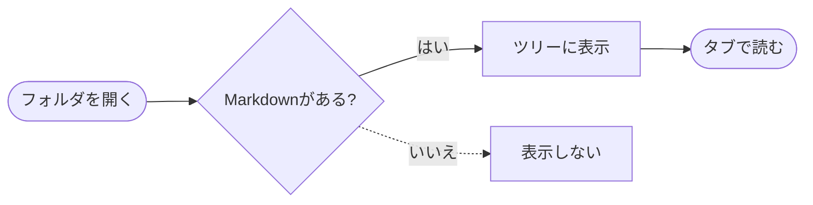
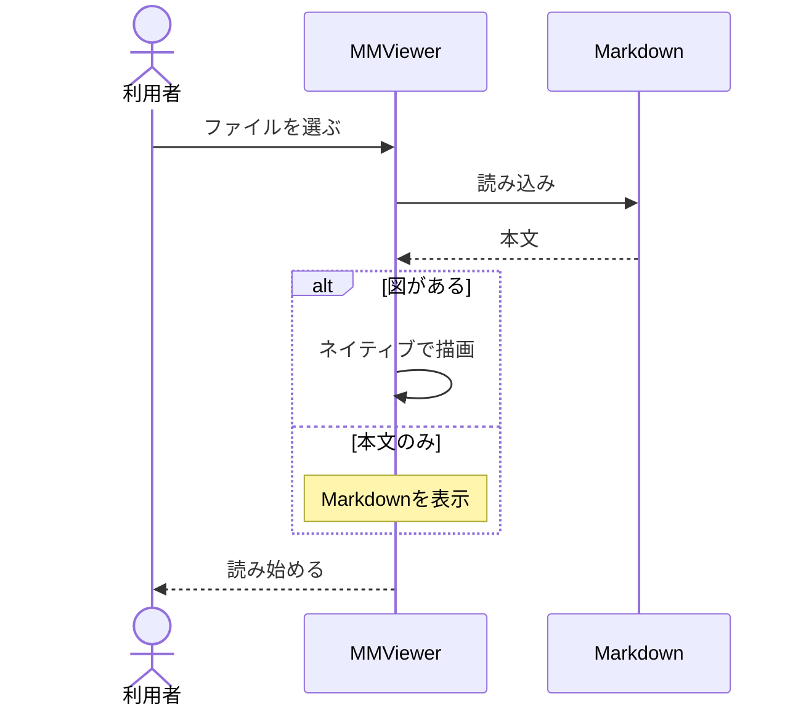

# MMViewer

**軽く、すばやく、Markdownを読む。**

左の「フォルダを開く」でフォルダを選ぶと、配下に `.md` がある階層だけを表示します。フォルダ名・アイコンをクリックすると開閉でき、ファイルを選ぶとタブで開きます。

## ネイティブの図表示



## よく使う操作

| 操作 | ショートカット |
| --- | --- |
| フォルダを開く | Ctrl + Shift + O |
| ファイルを開く | Ctrl + O |
| サイドメニューを開閉 | Ctrl + B |
| 文字サイズを変える | Ctrl + ホイール / Ctrl + ＋・－ |
| 本文を検索 | Ctrl + F |
| ソース表示を切り替える | Ctrl + U |
| 閉じたタブを戻す | Ctrl + Shift + T |

## 読み込みの流れ



> 図と本文はオフラインで描画します。対応外のMermaidは、その理由とソースを表示します。

- [x] 日本語の表示
- [x] 表・引用・コード・タスクリスト
- [x] ライト／ダークテーマ

```cpp
// 依存ランタイムを追加せずに起動
const auto appName = L"MMViewer";
```

[深い階層のMarkdownを開く](./ガイド/詳しい使い方/操作.md)
